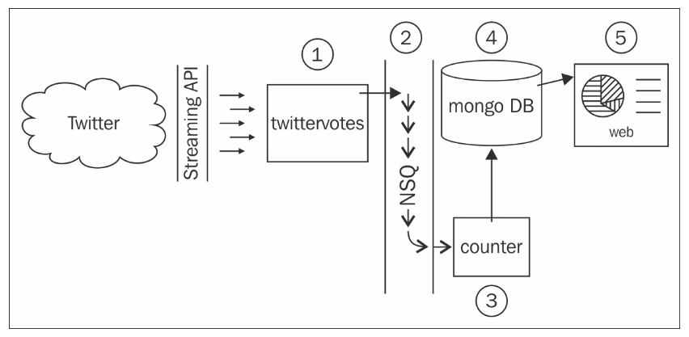

# Twittervotes
Building Distributed Systems and Workign with Flexible Data.

The system I will build in this repository will prepare us for a future where all democratic elections happen online on Twitter, of course. Our solution will collect and count votes by querying Twitter's streaming API for mentions of specific hash tags, and each component will be capable of horizontally scaling to meet demand.

The ideas discussed here are directly applicable to any system that needs true-scale capabilities.

