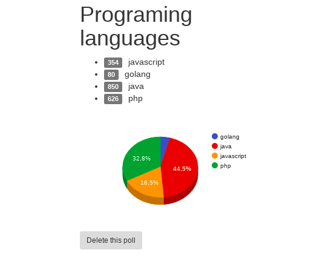
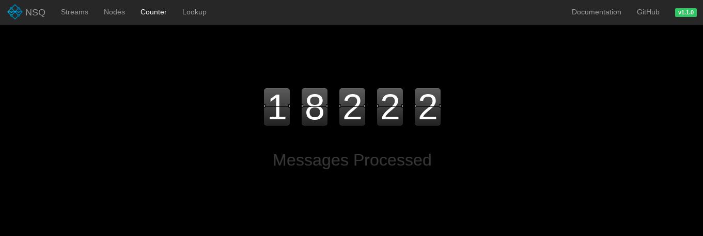

# Building Distributed Systems

Building Distributed Systems and Workign with Flexible Data.


The system I will build in this repository will prepare us for a future where all democratic elections happen online on Twitter, of course. Our solution will collect and count votes by querying Twitter's streaming API for mentions of specific hash tags, and each component will be capable of horizontally scaling to meet demand.

The ideas discussed here are directly applicable to any system that needs true-scale capabilities.


# Run app

* Remove the suffix _dist from the development_dist.env file inside of the env folder.

* Add your twitter application keys in the env/development.env file

* Create docker network

```sh
$ docker network create golang
```

* Start the MongoDB server, the nslookup and nsqd daemons. Also the counters, twittervotes, api and the web server:

```sh
$ docker-compose up
```


> The docker images building here, allows you to build a dev container that
*will reload code changes you make locally (without rebuilding the container)*
and a production container that serves the binary build. This is done using shared volumes,
[pilu/fresh](https://github.com/pilu/fresh), and build arguments.
To build a production image, you need to establish APP_ENV environment variable with the value "production"


Now that everything is running, open a browser and head to http://localhost:8081/.
Using the user interface, create a poll called Moods and input the options as happy,sad,fail,success.
These are common enough words that we are likely to see some relevant activity on Twitter.


Once you have created your poll, you will be taken to the view page where you will start to see the results coming in.
Wait for a few seconds and enjoy the UI updates in real time, showing real-time results:


Or why not, a survey about your favorite programming languages




If you want to manage NSQ messaging platform, you can open your browser and head to http://localhost:4171





# TODO
* Improve frontend system.
* Add Vuejs dashboard
* Create SPA.
* Use Socket